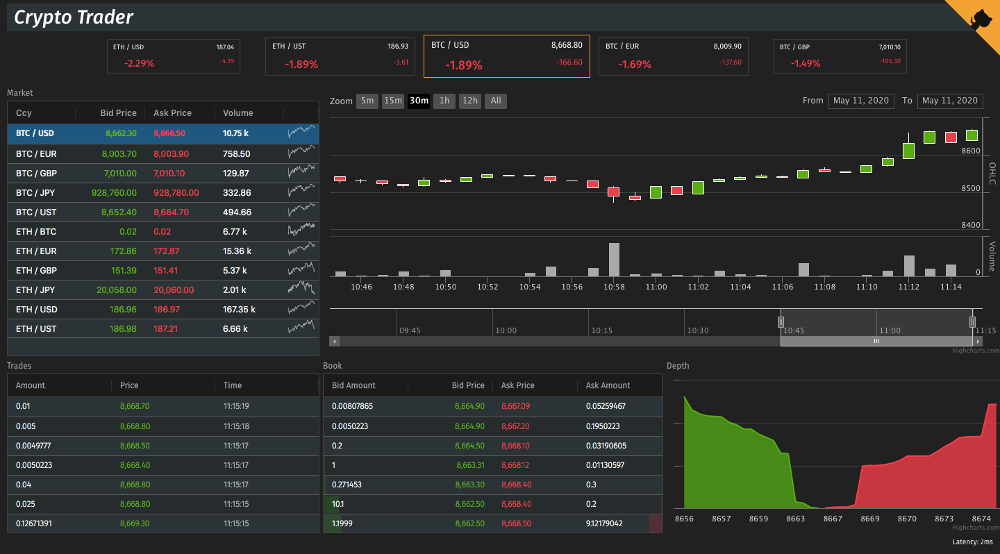

Crypto Trader is a real-time demo application using the Bitfinex WebSocket api.

## Stack

- React
- Redux
- RxJS
- Styled Components

## Scripts

### `yarn start`

Runs the app in development mode, with live reload. 
Open [http://localhost:3000](http://localhost:3000) to view it in the browser.

### `yarn test`

Launches the test runner in watch mode. 

### `yarn build`

Builds the app for production in the `build` folder. 
